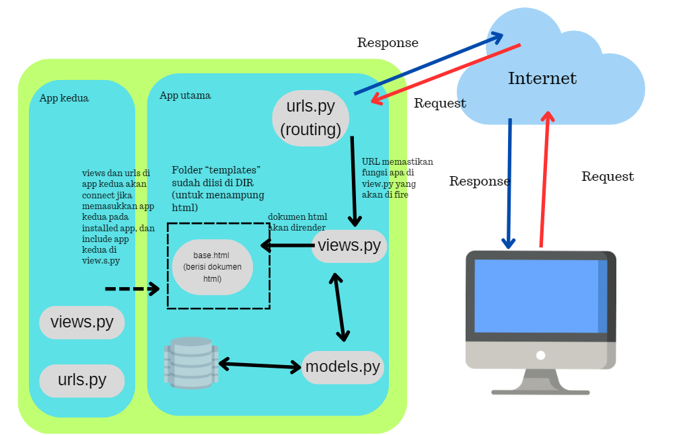

# TUGAS 5
## 1. Jelaskan manfaat dari setiap element selector dan kapan waktu yang tepat untuk menggunakannya
Element selectors dalam CSS berguna untuk menentukan gaya atau tampilan elemen HTML tertentu pada halaman website. Jenis - jenis element selector beserta manfaat dan penggunaan yang tepat, atnara lain:
1. Type Selector atau Element selector
Selector tipe memungkinkan kita untk memilih semua elemen dengna jenis tag tertentu, seperti 
 atau <h1>.  
2. Universal Selector (‘*’)
Universal selector digunakna utnk memilih semua elemen dalam dokumen HTML. 
3. ID Selector (‘#id’)
ID Selector digunakan untuk memilih elemen yang hanya berartibut ‘id’. Penggunaannya jika kita inigin mengganti gaya atau perilaku elemen dengan ID tertentu. 
4. Class Selector (‘.class’)
Class selector digunakan untuk memilih elemen dengan atribut ‘class’. Penggunaan class ini untuk mengelompokkan elemen yang memliki karakteristik serupa dan mengganti gaya atau perilaku mereka. 
5. Attribute Selector (‘[attribute]’)
Attribute selector memungkinkan kita untuk memilih elemen bedasarkan atribtu yang dimiliki, seperti ‘[type=”text”]’ untuk memilih input dengan atribut ‘type=”text”. 
6. Pseudo-class Selector (‘:pseudo-class;)
Pseudo-class selector memungkinkan kita untuk memilih elemen bedasrkan keadaan atau interaksi dengan elemen , seperti melakukan ‘:hover’ yang berfungsi untk mengubah gaya saat mouse kita berada di atas elemen. 
7. Pseudo-element Selector (‘::pseudo-element ‘)
Pseudo-element selector dapt digunakan untuk membuat gaya untuk bagian khusus elemen, seperti ‘::before’ dan ‘::after” untuk menambhakan konten sebelum dan sesudah elemen.  

## 2. Jelaskan HTML5 Tag yang kamu ketahui
a. !DOCTYPE html : ini bisa dibilang tidak masuk dalam tag tetapi ini digunakan untuk  deklarasi awal dokumen HTML5 untuk memberi tahu browser bahwa dokumen akan menggunakan standar HTML5.
b. html : menanadakan awal dan akhir dari dokumen HTML, di dalam tag ini berisi seluruh konten HTML
c. head: sebagai wadah untuk menyimpan informasi tentang dokumen, seperti tautan ke stylesheet, judul halama (title), dan lainnya. 
d. meta : digunakan untuk menyertakan metada dalam dokumen, speerti karakter encoding, deskripsi halaman, dan instruksi untuk mengendalikan indeks mesin pencari. 
e. title : untk menentukan judul halaman yang akan ditampilkan di tab browser
f. link: digunakan untuk menghubungkan dokumen HTML dengan stylesheet eksternal atau sumber daya lainnya
g.style : utnuk mengintegrasikan/ menyisipkan CSS langsung ke dalam dokumen HTML
h.script : digunakan utnuk menyisipkan skrip JavaScript ke dalam dokumen HTML, ini bisa ditempatkan di dalam bagian <head> atau <body>
i.body : berisi konten utama dari halaman website, termasuk teks, gambar, tautan, dan elemen lainnya. Konten ini yang akan menjadi tampilan kepada pengguna. 
j.header : untuk menandai bagian awal dari sebuah dokumen atau bagain dari halaman web, seperti judul, logo, atau elemen-elemen lain yang berhubungan dengan kepala halaman
k. nav : digunakan untuk mengelompokkan tautan navigasi dalam dokumen, seperti menu utama halaman website. 
l. main : menandakan konten utama dari dokumen,biasnaya hanya dibuat satu tag itu saja dalam satu halaman web
m. article : mengelompokkan konten mandiri dalam dokumen, seperti berita, posting blog, artikel. 
n. section : mengelompokkan konten yang memiliki tema atau konteks tertentu, dan membantu dalam pemahaman struktur halaman. 
o. aside : digunakan untuk menandai konten yang bukan bagian utama dari halaman, seperti sidebar yang berisi informasi tambahan atau tautan terkait.
p. footer : untuk menandai bagian akhir dari dokumen atau bagian halaman seperti biasa informasi kontak, tautan ke halaman lain, atau hak cipta 
q. figure dan figcaption : digunakan bersama-sama untuk menyertakan gambar atau ilustrasi dengan keterangan. 
r.video dan audio : digunakan untuk menyisipkan video atau audio dalam dokumen, dengan atribut yang memungkinkan dalam mengontrol pemutaran media
s.canvas : digunakan utnuk membaut gambar, grafik, dan animasi dalam menggunakan JavaScript
t.form : digunakan utnuk membuat formulir interkatif (pengguna dapat mengirimkan data ke server)
u.input: digunakan dalam formulir untuk mengambil berbagai jenis masukan, seperti teks, kotak centang, tombol radio, dll. 
v.button : digunakan untuk membuat tombol yang dapat diklik oleh pengguna
w.iframe : digunakan utnuk menanamkan dokumen HTML atau halaman webiste lainnya di dalam dokumen HTML. 
## 3. Jelaskan perbedaan antara margin dan padding
    Baik margin dan padding memengrauhi tata letak elemen dalam halaman web Keduanya memiliki perbedaan, antara lain: 
a. Margin:
    Margin merupakan area di luar batas elemen. Ini mengatur jarak antara elemen dan elemen-elemen lain di sekitarnya. Margin tidak memiliki latar belakang atau warna. Margin menagtur tata letak eleemn terhadap elemen-elemen lain. Elemen dapat diatur margin atas, bawah, kanan dan kiri dari elemen untuk mengontrol sebarap jauh elemen tersebut akan berjarak dari elemen-elemen tetangganya. Margin tidak memiliki pengaruh terhadap latar belakang elemen. 
b. Padding:
    Padding adalah area di dalam batas elemen. Ini mengatur ruang anatara batas elemen dan kontennya.  Padding dapat memliki latar belakang atau warna untuk padding elemen yang muncul di sekitar kontennya. Padding memengaruhi tata letak konten dalam elemen itu. Kita dapat mengatur padding atas, bawah , akan, dan kiri dari elemen untuk mengatur seberapa jauh konten akan berjarak dari batas elemen. Padding hanya memengaruhi elemen itu sendiri, tidak elemn-elemen di sekitarnya. 
## 4. Perbedaan antara Tailwind CSS dan Bootstrap
a. Pendekatan Desain
    - Tailwind CSS : Pendekatan “utility-first” yang memberikan banyak kelas kecil yang dapat digunakan untuk menggabungkan styling secara modular. Tampilan dalam HTML dengan menggabungkan kelas-kelas. 
    - Bootstrap : Pendekatannya lebih tradisional dalam desain. Bootstrap menyediakan sejumlah komponen user interface yang telah dirancang dengan baik yang dapat digunakan denagn mudah, serta gaya dan komponen yagntelah ditentukan sebelumnya. 
b. Ukuran dan Kustomisasi 
    - Tailwind CSS: Ukuran dan kustomisasi lebih ringan dan kita memililki lebih banyak kontrol atas tampilakn kta. Kita hanya menggunakan ap auyang kita butuhkan dan dapat menyeseuaikan tmapilan dengan mudah dengan mengedit konfigurasi. 
    - Bootstrap: Ukuran dan kustomisasi lebih besar dan memilki lebih banyak gaya bawaan serta komponen yagn telah dirancang sebelumnya. Jika kita hanya memerlukan eberapa komponen atau ingin tampilan yang sanagt khusus, penggunaan Bootstrap sangat berat. 
c. Kode HTML
    - Tailwind CSS: Di dokumen HTML, kita perlu menulis kode lebih bnyak karae harus menambhakan banyak kelas ke elemen untuk mengatur styling. 
    - Bootstrap: Memerlukan lebih sedikit penulisan kode HTML karena dapat mengguankan komponen Bootstrap yang sudha jadi. 
d. Tampilan dan Gaya
    - Tailwind CSS: Memiliki fleksibilitas yang lebih besar dalam mengontrol tampilan elemen dan memungkinkan tampilan yang sangat khusus. 
    - Bootstrap: Memberikan tampilan yang lebih konsisten dan tersturktu secara bawaan, tetapi kurang fleksibel untuk tampilan yang sangat khusus. 
- Kita mengguanakan bootstrap ketika kita memerlukan penegmbangan cepat denagn komponen user interface yang telah dirancang sebelumnya, ingin teingin tampilan yang konsisten dengan sedikit usaha desain, menghindari menulis banyak kode HTML untuk mengatur tampilan.
- Kita menggunakan Tailwind CSS ketika mengiginkan fleksibilitas maksimal dalam mengontorol tampilan dan tata letak elemen, menghindari ketergantungan pada banyak gaya bawaan yang mungkin kita tidak perlukan, dan siap menulis lebih banyak kode HTML untuk menggabungkan kelas - kelas Tailwind. 
## 5. Jelaskan bagaimana cara kamu mengimplementasikan checkist di atas secara step-by-step
Karena menggunakan static files, maka kita menaruh kode pada setting.py seperti STATIC_ROOT yang menentukan absolute path ke direktori files ketika menjalankan perintah collecstatic pada proyek dan terdapat STATIC_URL yang merupakan URL yang dapat diakses publik untk memperoleh static files.  Sedangkan di STATIC_URL merupakan URL dapat diakses publik untuk memperoleh static files tersebut.
Saya menggunakan ID Selecotr untuk menggunakan ID pada tag dalam satu halaman website yang saya terapkan pada template HTML di register.html:

    

	yang didalamnya terdapa input untuk username dan password . Sleanjutkanya di block meta saya mendefinsikan tag style <style>, yang mendefinsikan tiap class. sebagai salah satu contoh. 
 .register-container {
            display: flex;
            justify-content: center;
            align-items: center;
            height: 100vh;
            background: linear-gradient(45deg, #ff00cc, #3333ff, #00ccff, #33ff00);
            background-size: 400% 400%;
            animation: gradientAnimation 10s linear infinite;
        }

        /* Keyframes animation */
        @keyframes gradientAnimation {
            0% {
                background-position: 0% 50%;
            }
            100% {
                background-position: 100% 50%;
            }
        }

Untuk pengerjaan bonus, saya mengganti div class yang hanya berupa product-card menjadi 

Jika forloop.last adalah True, maka elemen div akan memiliki kelas product-card new-product.
Jika forloop.last adalah False, maka elemen div hanya akan memiliki kelas product-card

 .new-product {
            color: #e74c3c;
        }

untuk nama proudk terbaru teksnya menggunakan warna merah.

# TUGAS 4
## 1. Apa itu Django UserCreationForm, dan jelaskan apa kelebihan dan kekurangannya?
Django UserCreationForm adalah formulir bawaan Django untuk memudahkan pembuatan akun pengguna dalam aplikasi web, sehingga kita tidak perlu lagi membuat dari scratch untuk logika pendaftaran akun pengguna. Pada form ini , pengguna dapat memasukkan informasi seperti nama pengguna, kata sandi, dan alamat email. Kelebihan dari formulir bawaan ini, antara lain:
Mudah digunakan: Karena sudah terintegrasi dengan Django, kita tidak perlu membuat formulir pendaftaran dari awal, sehingga menghemat waktu dan usaha. 
Validasi otomatis : Data yang diinput oleh pengguna secara otomatis akan divalidasi, seperti kekuatan kata sandi dengan standar panjang dan karakteristik tertentu. 
Fleksibilitas: Formulir ini bisa disesuaikan sesuai dengan kebutuhan aplikasi kita. Kita bisa menambahkan atau menghapus field sesuai dengan kebutuhan kita. 
Keamanan: Kata sandi pengguna di enkripsi secara otomatis sebelum disimpan ke dalam database. Hal ini menjaga keamanan informasi pengguna. 
Kekurangan dari penggunaan UserCreationForm di Django dapat terjadi dalam beberapa situasi, seperti kebutuhan aplikasi kita tidak coockdengan template form abwaan atau jika kita menginginkan tingkat kustomisasi yang tinggi. Misalnya, saya ingin membuat validasi tambahan seperti verifikasi email, pengecekan unik untuk email dan nomor telepon, proses pendaftaran yang lebih rumit (seperti, permintaan persetujuan admin sebelum akun dapat diakses), dan ketiga tingkat kustomisasi tinggi (seperti, penyesuaian tampilan seperti penggunaan animasi khusus, integrasi dengan sistem pihak ketiga). 
Django UserCreationForm adalah formulir bawaan Django untuk memudahkan pembuatan akun pengguna dalam aplikasi web, sehingga kita tidak perlu lagi membuat dari scratch untuk logika pendaftaran akun pengguna. Pada form ini , pengguna dapat memasukkan informasi seperti nama pengguna, kata sandi, dan alamat email. Kelebihan dari formulir bawaan ini, antara lain:
Mudah digunakan: Karena sudah terintegrasi dengan Django, kita tidak perlu membuat formulir pendaftaran dari awal, sehingga menghemat waktu dan usaha. 
Validasi otomatis : Data yang diinput oleh pengguna secara otomatis akan divalidasi, seperti kekuatan kata sandi dengan standar panjang dan karakteristik tertentu. 
Fleksibilitas: Formulir ini bisa disesuaikan sesuai dengan kebutuhan aplikasi kita. Kita bisa menambahkan atau menghapus field sesuai dengan kebutuhan kita. 
Keamanan: Kata sandi pengguna di enkripsi secara otomatis sebelum disimpan ke dalam database. Hal ini menjaga keamanan informasi pengguna. 
Kekurangan dari penggunaan UserCreationForm di Django dapat terjadi dalam beberapa situasi, seperti kebutuhan aplikasi kita tidak coockdengan template form abwaan atau jika kita menginginkan tingkat kustomisasi yang tinggi. Misalnya, saya ingin membuat validasi tambahan seperti verifikasi email, pengecekan unik untuk email dan nomor telepon, proses pendaftaran yang lebih rumit (seperti, permintaan persetujuan admin sebelum akun dapat diakses), dan ketiga tingkat kustomisasi tinggi (seperti, penyesuaian tampilan seperti penggunaan animasi khusus, integrasi dengan sistem pihak ketiga). 

## 2. Apa perbedaan antara autentikasi dan otorisasi dalam konteks Django, dan mengapa keduanya penting?
Autentifikasi merupakan proses verifikasi identitas pengguna, yakni memastikan bahwa pengguna dapat mengklaim identitasnya adalah pengguna sebenarnya. Otorisasi merupakan proses yang memutuskan apa yang dapat dilakukan oleh pengguna yang telah diautentikasi, seperti mengendalikan akses ke sumber daya atau fitur tertentu dalam aplikasi. Baik autentikasi dan otorisasi penting dalam konteks Django, karena:
Autentifikasi memastikan bahwa hanya pengguna yang sah yang dapat mengakses suatu aplikasi, sehingga mekanisme melindungi data sensitif dan menghindari akses yang tidak sah. 
Otorisasi memungkinkan pengguna mengontrol apa yang dapat dilakukan oleh pengguna yang telah diautentikasi, sehingga berbagai tindakan yang tidak bertanggung jawab dari pengguna yang tidak memiliki izin dapat diatasi, seperti mengakses halaman tertentu atau mengedit data. 

## 3. Apa itu cookies dalam konteks aplikasi web, dan bagaimana Django menggunakan cookies untuk mengelola data sesi pengguna?
Cookies adalah file kecil yang disimpan di sisi klien (browser) dan digunakan oleh server web untuk menyimpan data sesi atau informasi pengguna. Dalam konteks Django, cookies digunakan untuk mengelola data sesi pengguna, seperti informasi otentikasi atau preferensi pengguna. Django menggunakan cookies untuk mengidentifikasi pengguna yang telah diotentikasi dan menyimpan informasi yang diperlukan untuk mempertahankan sesi pengguna, seperti token otentikasi atau ID sesi.

## 4. Apakah penggunaan cookies aman secara default dalam pengembangan web, atau apakah ada risiko potensial yang harus diwaspadai?
Secara default, penggunaan cookies dalam pengembangan web menjadi aman jika dilakukan dengan benar, tetapi terdapat beberapa risiko potensial yang perlu diwaspadai, antara lain:
Cross-Site Scripting (XSS) : XSS adalah serangan di mana penyerang memasukkan kode berbahaya (biasanya JavaScript) ke dalam halaman web yang kemudian dieksekusi oleh pengguna yang melihat halaman tersebut. Dalam serangan XSS, penyerang dapat mencuri cookies pengguna atau melakukan tindakan berbahaya atas nama pengguna jika cookies sesi atau informasi otentikasi tersimpan dalam cookies. Tanpa sanitasi yang cukup di sisi server, penyerang dapat mengeksploitasi celah ini untuk mencuri data atau menjalankan aksi yang tidak sah atas nama pengguna.
Session Hijacking : Serangan ini terjadi ketika penyerang mencuri token sesi pengguna atau cookies sesi yang valid untuk mengambil alih sesi pengguna yang sah. Jika cookies sesi pengguna dicuri, penyerang dapat menggunakan cookies tersebut untuk berpura-pura sebagai pengguna yang sah dan mengakses akun pengguna tanpa izin.
Cookie Theft: Penyerang dapat mencuri cookies pengguna jika mereka berhasil mengakses atau memanipulasi cookies yang tersimpan di perangkat pengguna. Ini dapat terjadi jika pengguna terinfeksi malware atau jika ada celah keamanan dalam aplikasi web. Jika cookies pengguna dicuri, penyerang dapat memanfaatkannya untuk mengakses akun pengguna, mengakses informasi pribadi, atau bahkan melakukan tindakan ilegal atas nama pengguna.
Data Privacy: Jika data pribadi atau sensitif tersimpan dalam cookies tanpa enkripsi yang cukup atau kebijakan privasi yang ketat, maka privasi pengguna dapat terancam. Jika data pribadi tersimpan dalam cookies tanpa enkripsi yang memadai, penyerang atau pihak yang tidak berwenang dapat dengan mudah mengakses data ini, yang dapat mencakup informasi seperti alamat email, informasi keuangan, atau informasi pribadi lainnya.

## 5. Jelaskan bagaimana cara kamu mengimplementasikan checklist di atas secara step-by-step (bukan hanya sekadar mengikuti tutorial).
UserCreationForm merupakan form bawaan dari Django untuk menampilkan form dengan logika untuk mendaftarkan user dengan standar pengisian salah satunya untuk password. Di file views.oy, dalam fungsi register, kita mengambil UserCreationForm() ke dalam variabel form, kemudian mengecek apa form valid atau tidak. Setelah pengecekan valid atau tidak itu baru register.html dirender.  
Kemudian, autentikasi dimasukkan ke dalam proses fungsi login user, dengan mengepasss request, username, dan password. 

fungsi logout dengan hanya menerima request dan men redirect ke main:login.  Untuk ketiga fungsi tersebut, kita juga membuat html. 
Ketiga fungsi untuk register, login_user, logout diimpor dari urls.py dan dimasukkan ke dalam urlpatterns. 
Karena ada fungsi show_main yang seharusnya diperlihatkan hanya untuk pengguna yang login maka kita mengimpor 
from django.contrib.auth.decorators import login_required
dan menambahkan 
@login_required(login_url='/login')
def show_main(request):

Menggunakan data dari cookies
Kita mengubah if user is Not none dengan menambahkan kode
response.set_cookie('last_login', str(datetime.datetime.now())) . 
Kode diatas akan membuat _cookie last_login dan menambahkannya ke dalam response. Last_login hasil juga dimasukkan ke dalam variabel context, ini akan ditampilkan di halaman web. 
Sedangkan untuk fungsi logout_user, kita menambahkan kode 
response.delete_cookie('last_login')
Ketika user melakukan log out, kita menghapus cookie yang ada. 
Karena last_login dimasukkan ke dalam context maka ini ditampilkan dengan memasukkan {{last_login}} kedalam html. 

Menghubungkan model product dengan user
Dimulai dengan menambahkan kode diabwah untuk models.py
from django.contrib.auth.models import User

Kemudian membuat class Product 
class Product(models.Model):
user = models.ForeignKey(User, on_delete=models.CASCADE)
kode dibatas membuat relationship yang mengasosiasikan suatu produk dengan seorang user. 

Kemudian untuk fungsi create_product di views.py keitka mau save form menjadi product ditambahkan commit=False untuk mencegah Djagi tidak langsung disimpan langsung ke database, sehingga kita bisa memodifikasi terlebih dahulu. Kemudian kita juga membuat field product dengan product.user = request.user. 

Di fungsi show_main, kode Product.objects.filter ditambah parameternya dengan user=request.user dengan context ditambah dengan ‘name’ : request.user.username
Tambahan untuk membuat bonus
Mendefinisikan fungsi  seperti add_product, substract_product di class Product di models.py
Ketiga fungsi menggunakan kode @login_required(login_url='/login')
Untuk memastikan bahwa hanya akun yang sedang login dengan produknya sendiri saja yang bisa melakukan add, subtract dan delete product ini. 
untuk tambahan product -> menambahkan fungsi add_product, yang didalamnya berupa:
@login_required(login_url='/login')
def add_product(request, product_id):
    if request.fungsi == 'POST':
        product = Product.objects.get(pk=product_id)
        quantity = 1  
        product.amount += quantity
        product.save()
    return redirect('main:show_main')
fungsi menge-pass request dan product_id, request untuk memastikan bahwa fungsinya berupa POST, kemudian mengambil product berdasarkan product_id yang sudah dipass, mendefinisikan interger untuk variabel quantity dengan angka 1. Kemudian, mengupdate amount dari product dengan quantity dengan menambah field dari product, kemudian menyimpan product dengan field terbarunya, setelah itu laman di redirect ke main. 
untuk mengurangi product -> menambahkan fungsi subtract_product, yang didalamnya berupa:
Sedangkan sama untuk mengurangi product, juga mengambil kuantitas dari product dengan mengambil field amount dan menguranginya dengan variabel quantity yangs ama dengan 1. Bedanya hanya memastikan bahwa produt_amount itu lebih besar dari sama dengan 1, sehingga jika nilainya sudah 0 tidak dikurangi lagi. 
untuk mendelete product -> menambahkan fungsi delete_product yang didalamnya berupa :
def delete_product(request, product_id):
    product = get_object_or_404(Product, id=product_id)
    # Memastikan hanya pemilik produk yang dapat menghapusnya
    if product.user == request.user:
        product.delete()
    return redirect('main:show_main')
fungsi delete product, pertama-tama mengambil product terlebih dahulu dengan get_object_or_404, 404, untuk respon ketika tidak ada product yang diambil. Kemudian, memastikan lagi bahwa request user sekarang adalah pemilik produk dengan product.user. Setelah itu mendelete produk dan balik lagi ke redirect, melalui (‘main : show_main’).

Setelah memasukkan fungsi di views, kita membuat path di urls pattern
  path('add_stock/<int:product_id>/', add_product, name='add_product'),
    path('subtract_product/<int:product_id>/', subtract_product, name='subtract_product'),
    path('delete_product/<int:product_id>/', delete_product, name='delete_product'),

Untuk interface, memasukkan button add, subtract dan delete ke dalam main.html, tepatnya pada tabel  dengan tiap button dikaitkan dengan action yang sudah didefinisikan seperti ini. 
 <td style="border: 1px solid #000; padding: 8px;">
                {{ product.amount }}
                <form fungsi="post" action="">
                    
                    <button type="submit" name="action" value="add">Tambah</button>
                </form>
                <form fungsi="post" action="">
                    
                    <button type="submit" name="action" value="subtract">Kurang</button>
                </form>
            </td>

# TUGAS 3
## 1. Perbedaan POST dan GET
### a. Dalam pengiriman data
- POST, data dikirim ke server sebagai bagian dari permintaan HTTP, data ini tidak terlihat dalam URL. Karena tersembunyi, maka cocok untuk mengirim data sensitif seperti kata sandi.
- GET, data dikirim sebagai bagian dari URL dengan parameter yang terlihat dalam query string. Kurang aman, karena data terlihat dalam URL.
### b. Penggunaan Caching
- POST tidak di-cache oleh browser
- GET biasanya di cache oleh browser
### c.Tujuan penggunaan
- POST digunakan untuk mengirimkan data hasil isi form seperti pendaftaran penggunaan, memuat komentar, dan lain-lain.
- GET digunakan untuk meminta data dari server seperti pencarian atau tautan berbagi.
### d. Perubahan pada data server
- POST dapat menghasilkan perubahan pada data server setiap kali digunakan, seperti penambahan data , dan lain-lain
- GET hanya digunakan untuk membaca data sehingga tidak menghasilkan perubahan pada server.

## 2. Apa perbedaan utama antara XML, JSON, dan HTML dalam konteks pengiriman data?
Perbedaan utama dibagi menjadi 3 bagian, yakni format, struktur, dan tujuan.
- XML (eXtensible Markup Language)
Merupakan bahasa markup yang menggunakan tag untuk menandai elemen -elemen dalam dokumen, sehingga dalam menggunakannya terdapat aturan ketat untuk sintaksis.
Memiliki struktur hierarkis yang merepresentasikan data dengan baik dalam struktur pohon.
Digunakan untuk pertukaran data yang sangat terstruktur, seperti SOAP (Simple Object Access Protocol) dalam layanan web atau penyimpanan konfigurasi data dalam format yang dapat dibaca oleh manusia.
- JSON (JavaScript Object Notation)
Merupakan format daya yang lebih ringkas dan ringan daripada XML. Sintaksnya mirip dengan JavaScript yang digunakan dalam merepresentasikan objek dan array.
Strukturnya sederhana dengan objek terdiri dari pasangan key:value dan array yang berisi nilai-nilai.
Digunakan secara luas dalam pertukaran data antara aplikasi web modern, salah satunya dalam RESTful API, karena kesederhanaan, kecepatan, dan efisiensinya. JSON cocok untuk berbagai jenis data, termasuk data dinamis yang diproses oleh JavaScript di sisi klien.
- HTML (Hypertext Markup Language)
Merupakan bahasa markup yang digunakan untuk membuat halaman web. HTML punya sintaks khusus yang mengatur tampilan dan struktur konten pada halaman web
Struktur dokumen khusus dengan elemen seperti <html>, <head>, <body> ,dan tag-tag lainnya
Digunakan untuk membuat halaman web yang dapat ditampilkan oleh browser web, sebagai antarmuka pengguna pada aplikasi web.
### 3. Mengapa JSON sering digunakan dalam pertukaran data antara aplikasi web modern?
- Format JSON sederhana sehingga data mudah dipahami oleh manusia dan mudah diproses juga oleh komputer. 
- Ukuran data format JSON lebih kecil dibandingkan dengan XML, sehingga lebih efisien dalam penggunaan bandwidth dan pengiriman data melalui jaringan. 
- JSON berintegrasi dengan baik dengan JavaScript, yang merupakan bahasa klien yang umum digunakan di aplikasi web modern, sehingga sangat cocok digunakan dalam komunikasi antara sisi klien dan sisi server. 
- Format JSON cocok untuk pertukaran data antara aplikasi web karena banyak bahasa pemrograman dan framework web yang memiliki dukungan bawaan untuk membaca dan menulis data JSON. 
### 4. Jelaskan bagaimana cara kamu mengimplementasikan checklist di atas secara step-by-step (bukan hanya sekadar mengikuti tutorial).
- Membuat input form untuk menambahkan objek model pada app sebelumnya
    Dengan membuat berkas baru bernama forms.py di main yang gunanya mendefinisikan struktur form apa yang akan ditampilkan untuk menginput data produk baru. Ada dua didefinisikan, yakni data yang disimpan dalam bentuk Product dengan atribut seperti name, price, amount, dan description. 
    Setelah membuat kelas struktur form di forms.py, untuk penggunaannya kita harus menyambungkan nya di views.py dengan mengimpor class ProductForm dari forms.py tadi. Di views.py, kita membuat  
    form = ProductForm(request.POST or None)
    di dalam sebuah fungsi create_product, tetapi di dalamnya terdapat pengecekan apakah pengisian form sudah valid dah apakah benar request metodenya POST. Jika benar, maka dipanggil form.save() da balik ke main.html. Jika tidak valid maka tetap di create_product.html dengan context ({‘form’ : form}).
    Pada fungsi show_main karena tidak hanya menampilkan name dan class pada main-html, kita harus menambahkan  products juga. 
- Menambahkan 5 fungsi views untuk melihat objek yang sudah ditambahkan dalam format HTML, XML, JSON, XML by ID dan JSON by ID. 
    Baik XML dan JSON  menggunakan import dari HttpResponse dan serializers (untuk menerjemahkan objek model menjadi format lain seperti XML atau JSON). Bedanya kalau tanpa id, maka parameter fungsinya hanaya request saja. Kemudian, jika kita mau objek model dalam bentuk XML, maka paramter dari serializernya “xml”, sedangkan kalau JSON maka paramternya “JSON”. Kalau dengan id,  maka tidak menggunakan all(), tetapi filter(pk=id) sehingga parameternya juga tidak hanya request tetapi juga id. 
- Membuat routing URL untuk masing-masing views yang telah ditambahkan pada poin 2
    Routing dari masing-masing fungsi yang ada di views dilakukan dengan terlebih dahulu menambahkan import dari from main.views. Setelah ditambahkan baru menambahkan path url ke dalam urlpatterns agar fungsi di views tadi bisa diakses. Salah satu contoh:
    `path('json/', show_json, name='show_json'),`
- Mengakses kelima URL di poin 2 menggunakan Postman
    Postman digunakan sebagai data viewer untuk mengetes apakah request baru dengan method GET sudah benar dikirim dengan baik. Pengecekannya harus terlebih dahulu run server kode kita dengan  python manage.py runserver.
- Menambahkan bonus berupa kalimat “ Kamu menyimpan X item pada toko ini”
    Penambahan dilakukan dengan dengan membuat variabel total_items terlebih dahulu pada views.py yang ada di main, dengan kode
    ` total_items = products.count()`
   total_items = products.count()
    Kemudian, dimasukan ke dalam fungsi dictionary. Karena show_main me-render halaman main.html, maka di main.html, kita memasukkan 
    `
Kamu menyimpan {{ total_items }} item pada toko ini.
`
## Foto POSTMAN
- XML
.png)
- XML by ID
.png)
- JSON
.png)
- JSON by ID
.png)

# TUGAS 2
## 1. Jelaskan bagaimana cara kamu mengimplementasikan checklist di atas secara step-by-step (bukan hanya sekadar mengikuti tutorial).
- Membuat sebuah proyek Django baru.
`django-admin startproject nama_proyek`

    Proyek ini berfungsi untuk menampung keseluruhan situs web atau aplikasi web yang dibangun, sehingga di dalamnya dapat dilakukan pengaturan global proyek, seperti mengatur database, URL, dan konfigurasi lainnya. Di dalamnya terdapat __init__.py, asgi.py, settings.py, urls.py, wsgi.py, dan manage.py.
-  Membuat aplikasi dengan nama main pada proyek tersebut.
    Dalam virtual environment, kita membuat aplikasi dari proyek STOKTOKOSARAS dengan kode
    `python manage.py startapp main`
    Kode ini membuat direktori baru dengan nama main, yang didalamnya terdapat berkas-berkas dasar untuk keperluan aplikasi, seperti models.py (untuk mendefinisikan model-model), views.py (menghubungkan permintaan HTTP dengan logika bisnis dan tampilan yang akan digunakan dalam respons, seperti interaksi dengan data, proses permintaan, dan pemerian tampilan pada pengguna), urls.py (unuk mendefinisikan routing), dan admin.py (untuk memanajmeni admin aplikasi). __init__.py berupa berkas kosong (menunjukkan direktori apliasi merupakan sebuah paket Python yang dapat diimpor). 
    tidak lupa menambahkan ‘main’ pada INSTALLED_APPS pada setting.py karena kita membentuk suatu app dengan nama main, app ini harus didaftarkan. 
    Untuk tampilan HTML-nya kita membuat folder templates.
-  Melakukan routing pada proyek agar dapat menjalankan aplikasi main.
    Setelah menambahkan aplikasi, agar dapat dijalankan, kita melakukan routing. Routing adalah proses pengarahan permintaan HTTP yang diterima oleh server web ke fungsi atau aksi yang telah didefinisikan pada aplikasi web kita. TIndakannya itu akan diarahkan ke views.  Penambahannya dengan mengetik pada urlpatterns dengan kode
    `from main.views import show_main
    app_name = 'main'
    path('', show_main, name='show_main'),`
    path untuk URLnya string kosong (‘ ‘), ini dibuat seperti ini agar ketika pengguna masuk ke domain situs web tanpa tambahan path atau akar situs maka yang dimunculkan fungsi show_main. 
-  Membuat model pada aplikasi main dengan nama Item dan memiliki atribut wajib sebagai berikut.
    Langkah ini dilakukan di model.py karena model.py merupakan tempat untk mendefinsikan sturktur model dalam Django. Model digunakan untuk menggambarkan bagaimana data akan disimpan dalam basis data kita. Di dalam model bernama “Item”, dalam tugas ini, kita harus memiliki tiga atribut wajib seperti, “name”, “amount”, dan “description” dengan jenis tipe-tipe berbeda, seperti Char, Integer, dan Text. Jadi tiap objek yang dibuat akan memiliki attribute ini.  Kedepannya, karena program STOKTOKOSARAS ada atribut-atributnya yang saya tambahkan di kemudian. 
    Setelah kita mendefinisikan bagaimana bentuk format data dengan atributnya, untuk dalam tampilan website kita perlu file HTML dengan membuat template. Folder templates harus dimasukkan ke dalam TEMPLATES pada setting.py. 
    Di tutorial 2, menggunakan base.html untuk template utama, sehingga untuk tiap html yang ada terdapat 
    Berhubungan dengan atribut produk, untuk create produk juga perlu form untuk struktur produk dengan menambahkan kode pada forms.py
-  Membuat sebuah fungsi pada views.py untuk dikembalikan ke dalam sebuah template HTML yang menampilkan nama aplikasi serta nama dan kelas kamu.
    Sejauh ini dalam views, saya menggunakan dua jenis fungsi. Satu untuk membuat objek, satu lagi untuk menampilkan objek tersebut ke dalam html. 
    `def show_main(request):
        products = Product.objects.all()

        context = {
            'name': 'Pak Bepe', # Nama kamu
            'class': 'PBP A', # Kelas PBP kamu
            'products': products
        }
        return render(request, "main.html", context)`
    Fungsi diatas ini menerima argumen request yang mewakili permintaan HTTP yang dikirim pengguna ketika mereka mengakses halam tertentu. Kemudian, kita mengambil semua objek yang ada dalam model Product dengan query ‘Product. objects.all()’. Kemudian dalam context ini , memuat dictionary. Dan return render(request, “main. html”, context) ini ada terdapat ‘render’ yang menggabungkan template HTML dengan data yang diberikan dalam bentuk context. 
    `def create_product(request):
        form = ProductForm(request.POST or None)

        if form.is_valid() and request.method == "POST":
            form.save()
            return HttpResponseRedirect(reverse('main:show_main'))

        context = {'form': form}
        return render(request, "create_product.html", context)`
    Ini fungsi kedua yang bertujuan untuk  menangani pembuatan dan penyimpanan data produk baru ke dalam basis data. 
    `form = ProductForm(request.POST or None)
        if form.is_valid() and request.method == "POST"`
    ini memeriksa apakah form tersebut dibuat dengan valid atau permintaan merupakan metode HTTP POST. 
    form.save()
    produk baru yang diisi oleh pengguna akan disimpan ke dalam basis data sesuai dengan model Product yang telah didefinisikan sebelumnya. 
    return HttpResponseRedirect(reverse('main:show_main'))
    setelah data produk baru disimpan, akan diarah ke halaman “show_main” dengan HttpResponseRedicrect. reserve digunakan untuk menghasilkan URL berdasarkan nama view, ini untuk menghindari hardcoding URL di dalam kode. 
    jika isi form tidak valid atau permintaan bukan POST, atau pengguna memang mengakses halaman untuk pertama kali, maka halaman akan di render dengan menampilkan form input kepada pengguna. 
-  Membuat sebuah routing pada urls.py aplikasi main untuk memetakan fungsi yang telah dibuat pada views.py.
    Routing dilakukan untuk memetakan URL yang diterima oleh aplikasi web dengan fungsi view yang akan menangani permintaan tersebut. Kita menambahkan path ke dalam urlpatterns yang ada di dalam urls.py, seperti untuk dua fungsi di views, untuk show_ main dan untuk create_product. 

## 2. Buatlah bagan yang berisi request client ke web aplikasi berbasis Django beserta responnya dan jelaskan pada bagan tersebut kaitan antara urls.py, views.py, models.py, dan berkas html.

Ketika ada request client maka pertama diarahkan ke urls.py terlebih dahulu. Urls.py akan melakuakn routing dan memilih fungsi apa yang ada di views.py yang akan difire. Pada fungsi di views.py mengembalikan html yang ditaruh di folder templates yang dirender. Jika dalam requestnya ada berhubungan dengan data, seperti menambahkan item melalui form, maka akan dipanggil model juga. Data tersebut akan ditambah berdasarkan logika yang sudah didefinisikan di models.py, seperti atribut data. 

## 3. Jelaskan mengapa kita menggunakan virtual environment? Apakah kita tetap dapat membuat aplikasi web berbasis Django tanpa menggunakan virtual environment?
- Virtual environment digunakan agar tidak memunculkan adanya konflik dependensi antara proyek satu dengan proyek lainnya. Misalnya, proyek A membutuhkan paket A versi 2.0 sedangkan proyek B membutuhkan paket A versi 1.0. Tanpa virtual environment, ketika kita langsung secara global mengupdate paket A menjadi versi 2.0, proyek B kita bisa saja terjadi error. Virtual environment ini juga berfungsi untuk menjaga kebersihan lingkungan, pendistribusian proyek dengan orang lain, mengisolasi lingkungan pengujian proyek, dan menghindari adanya penyebaran potensi risiko keamanan antara semua proyek yang berbagi lingkungan yang sama. 
- Tetap bisa, tetapi berisiko untuk terjadi nya konflik dependensi dan kerusakan karena penyebaran potensi risiko keamanan dapat terjadi dibandingkan dengan pembuatan aplikasi dilakukan dalam virtual environment. 

## 4. Jelaskan apakah itu MVC, MVT, MVVM dan perbedaan dari ketiganya.
- MVC (Model-View-Controller)
    Model bertanggung jawab untuk mengelola data dan logika aplikasi. Model merupakan bagian yang menggambarkan struktur data dan operasi yang dapat dilakukan pada data. 
    View bertanggung jawab untuk menampilkan data kepada pengguna dalam tampilan antarmuka pengguna (user interface). 
    Controller bertanggung jawab untuk mengelola input dari pengguna dan mengirimkan perintah ke model atau view. Controller adalah penghubung antara model dan view.
- MVT (Model-View-Template)
    Template adalah komponen tambahan dalam MVT yang digunakan untuk tampilan yang dinamis. Templates menggambarkan data dari Model yang direpresentasikan dalam View. Template memnungkinkan penggunaann variabel dan logika sederhana untuk mengatur tampilan berdasarkan data dari Model. 
- MVVM (Model-View-ViewModel)
    Model dalam MVVM juga bertanggung jawab untuk mengelola data dan logika bisnis aplikasi , seperti dengan konsep Model dalam MVT, tetapi model lebih berfokus pada pengelolaan data dan sering kali lebih terlibat dalam komunikasi dengan sumber data eksternal seperti basis data atau API.  Model juga berkomunikasi dengan ViewModel yang kemudian mengelola presentasi data untuk View. 
    ViewModel merupakan komponen tambahan yang bertindak sebagai perantara antara Model dan View. ViewModel ini mengubah data dari Model menjadi format yang dapat ditampilkan di View dan juga menangani interaksi pengguna yang dikirimkan kembali ke Model. 
- Perbedaan Utama
MVC adalah pola arsitektur yang lebih umum digunakan dalam pengembangan perangkat lunak pada umumnya, dengan Controller bertindak sebagai penghubung antara Model dan View. MVT adalah pola arsitektur yang digunakan dalam kerangka kerja Django, dengan penggunaan Template untuk menghasilkan tampilan dinamis dalam aplikasi web. MVVM sering digunakan dalam pengembangan aplikasi desktop dan mobile yang memerlukan tampilan yang lebih dinamis dan interaksi antara tampilan dan data yang lebih kompleks. ViewModel berfungsi sebagai perantara antara Model dan View.

